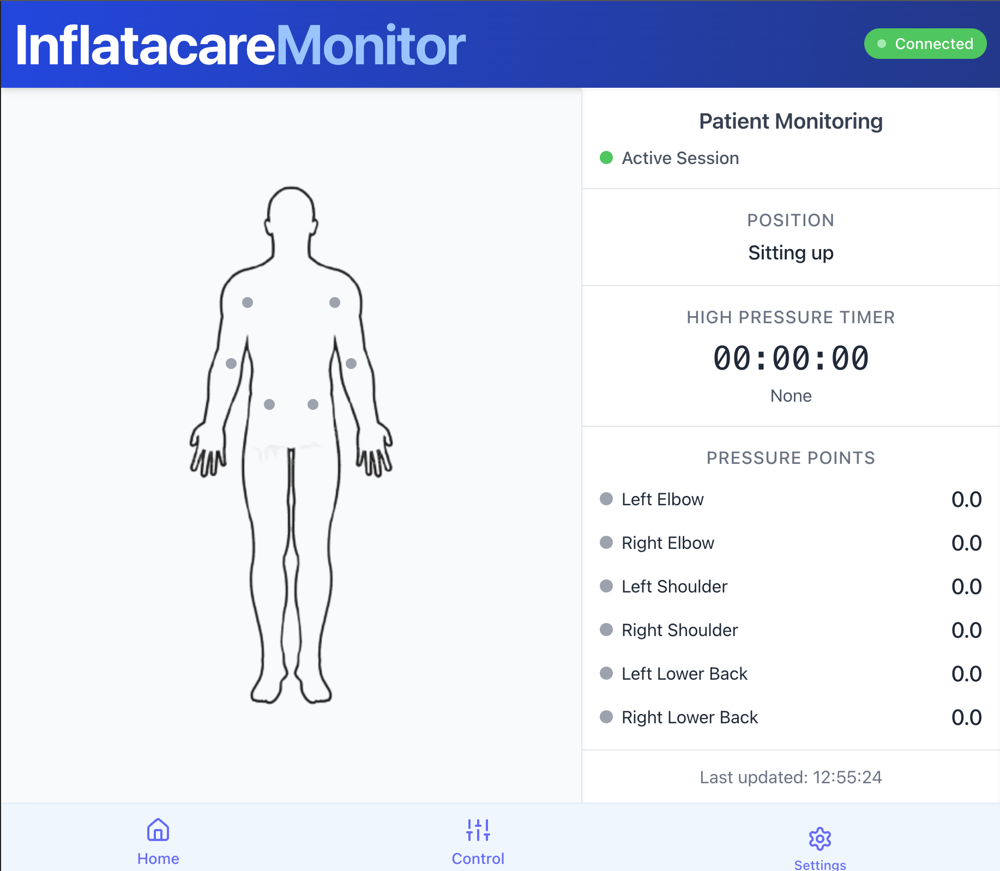

# InflataCare - Bedsore Prevention System


## Overview
InflataCare is a comprehensive web application designed to combat bedsores among elderly and bedridden patients. By monitoring pressure points and providing automated inflation controls, the system helps prevent pressure ulcers that develop from prolonged periods in the same position. The application interfaces with Arduino IoT Cloud Server to visualize pressure data in real-time and allows caregivers or patients to control inflation settings to redistribute pressure as needed.


## Table of Contents
- [Features](#features)
  - [Real-time Pressure Monitoring](#real-time-pressure-monitoring)
  - [Inflation Control](#inflation-control)
  - [Customizable Settings](#customizable-settings)
- [Technology Stack](#technology-stack)
- [System Architecture](#system-architecture)
- [Screenshots](#screenshots)
- [Installation](#installation)
  - [Prerequisites](#prerequisites)
  - [Setting up the development environment](#setting-up-the-development-environment)
  - [Production deployment](#production-deployment)
- [Usage](#usage)
  - [Pressure Monitor Dashboard](#pressure-monitor-dashboard)
  - [Inflation Control](#inflation-control-1)
  - [Settings Configuration](#settings-configuration)
- [Arduino Integration](#arduino-integration)
- [Contributing](#contributing)
- [License](#license)
- [Acknowledgments](#acknowledgments)
- [Contact](#contact)

## Features

### Real-time Pressure Monitoring
* Visualizes pressure applied at key body points through an intuitive interface
* Tracks accumulated time when pressure thresholds are exceeded
* Provides alert notifications when pressure remains high for too long



### Inflation Control
* Wireless control of air pump systems
* Preset position controls (sitting up, left side, right side)
* Intuitive interface for caregivers or patients to use


### Customizable Settings
* Configure maximum pressure thresholds based on patient needs
* Set time thresholds for alerts
* Personalize notification preferences
* Dark mode support


## Technology Stack
* **Frontend**: React.js, Tailwind CSS
* **Backend**: Node.js server
* **Communication**: MQTT protocol for persistent connection
* **IoT Integration**: Arduino IoT Cloud
* **Real-time Updates**: WebSocket for live data transmission

## System Architecture
```
User Interface (React) <--> Node.js Server <--> MQTT <--> Arduino IoT Cloud <--> Physical Devices
```

## Screenshots


## Installation

### Prerequisites
* Node.js (v14.0.0 or higher)
* npm (v6.0.0 or higher)
* Arduino IoT Cloud account
* Arduino devices with pressure sensors and inflation pumps

### Setting up the development environment
1. Clone the repository:
   ```bash
   git clone https://github.com/yourusername/inflatacare.git
   cd inflatacare
   ```

2. Install dependencies:
   ```bash
   npm install
   ```

3. Set up Arduino IoT Cloud

   a. Create an Arduino IoT Cloud account
      Go to [Arduino IoT Cloud](https://app.arduino.cc/) and sign up or log in.

   b. Create a new Thing
      - Click on "Create Thing".
      - Give it a name (e.g., InflataCareThing).
      - Add a device (choose your Arduino board or set up a virtual device).
      - Add variables (e.g., pressure, isInflating) and set appropriate types and permissions (Read/Write, etc.).

   c. Link to a new Sketch
      - After creating your Thing, Arduino Cloud will automatically generate a sketch.
      - Open the sketch in the Web Editor or Arduino IDE.

   d. Copy and paste your code
      - In your project, locate the Arduino sketch folder (typically found under /arduino_code or similar).
      - Open the .ino file.
      - Copy its contents and paste it into the Arduino Cloud-generated sketch.
      - Add your own WIFI key and password in Sketch Secrets file.

   e. Verify and Upload
      - In the Web Editor, click Verify to ensure the code compiles.
      - Connect your Arduino board and click Upload.
      - Make sure the board connects successfully and your variables appear on the dashboard.

   f. Get the required credentials
      - On the Thing page, click on the three-dot menu > API Keys.
      - Generate and copy the Client ID and Client Secret.
      - Copy the Thing ID from the Thing’s URL or settings.
   
   For more information on setting up the Arduino hardware, please refer to youtube video on how configure your arduin to the IoT Server.
   
4. Set Up Arduino IoT Cloud Server:
   Create a `.env` file in the project root and add your configuration:
   ```bash
   VITE_API_URL=http://your-server-address:3000
   CLIENT_ID=your_client_id
   CLIENT_SECRET=your_arduino_api_key
   THING_ID=your_thing_id
   PORT=3000
   ```

4. Start the backed development server:
   ```bash
   cd inflatacare_backend
   npm start
   ```

5. Start the frontend development server:
   ```bash
   cd inflatacare_frontend
   npm i
   npm run dev
   ```

### Production deployment
1. Build the production version:
   ```bash
   npm run build
   ```

2. Deploy the contents of the `dist` directory to your web server.

## Usage

### Pressure Monitor Dashboard
* View real-time pressure readings from all sensors
* Monitor accumulated pressure time for each point
* Observe visual alerts when thresholds are exceeded

### Inflation Control
* Select a body section (T, L, R) to activate controls
* Choose inflation levels (0-4) for the selected section
* Set the patient's position based on medical requirements

### Settings Configuration
* Set maximum weight threshold (recommended: 60-80g)
* Configure maximum time threshold (recommended: 20-40 minutes)
* Enable/disable notifications
* Toggle dark mode and auto-connect features

## Arduino Integration
The system connects to the following Arduino IoT Cloud properties:
* `fRS1` through `fRS6`: Pressure sensor readings
* `highestAccTime`: Highest accumulated time above threshold
* `alertStatus`: Bit-encoded status for all sensors

## Contributing
We welcome contributions to the InflataCare project. Please follow these steps:
1. Fork the repository
2. Create a feature branch (`git checkout -b feature/amazing-feature`)
3. Commit your changes (`git commit -m 'Add some amazing feature'`)
4. Push to the branch (`git push origin feature/amazing-feature`)
5. Open a Pull Request

## License
This project is licensed under the MIT License - see the LICENSE file for details.

## Acknowledgments
* Healthcare professionals who provided expertise on bedsore prevention
* The Arduino community for IoT support
* All contributors who have helped with development and testing

## Contact
Project Link: https://github.com/yourusername/inflatacare

For support or inquiries, please contact: support@inflatacare.com

© 2025 InflataCare. All Rights Reserved.
